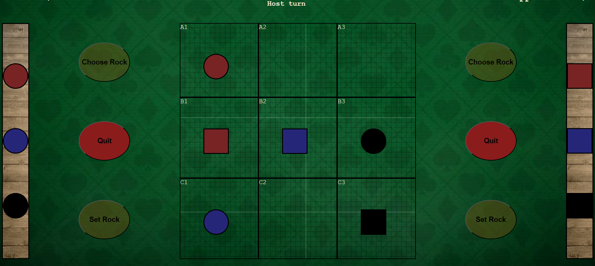
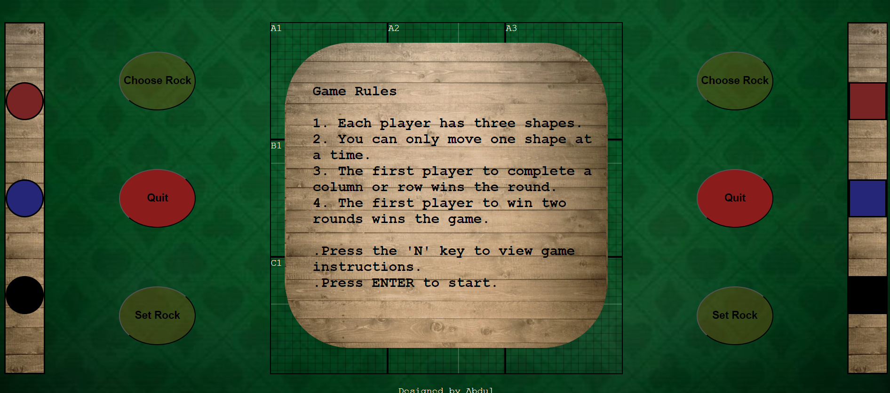

# Tish-Tisha Game

## Description

A children's strategy game to develop critical thinking skills.

## Table of Contents

- [Game Rules](#game-rules)
- [Why This Game](#why-this-game)
- [How to Play](#How-to-Play)
- [Technical Details](#technical-details)
- [Code Structure](#Code-Structure)
- [Contact](#contact)

## Game Rules

1. **Three Shapes for Each Player:**

   - Each player starts with three unique shapes.

2. **One Move at a Time:**

   - Players can move only one shape in each turn.

3. **Complete a Row or Column to Win:**

   - The first player to complete a column or row wins the round.

4. **Two Round Victory:**
   - The first player to win two rounds emerges as the ultimate game champion.

## why this game

Tish-Tisha is designed to foster strategic thinking skills in children. It introduces a delightful twist to classic games like X/O, adding an extra layer of complexity to decision-making. Moving the rocks requires careful planning, making every turn a thrilling challenge for young minds.

**Features:**

- Engaging gameplay that stimulates strategic thinking.
- Colorful and intuitive design for a child-friendly experience.
- An exciting twist on traditional games to keep kids entertained and thinking.

## How to Play

1. **Start the Game:**

   - Press the "Choose Shape" button to begin.

2. **Make Your Move:**

   - Click on the shape you want to move.

3. **Place Your Shape:**

   - Click on the box where you want to place the selected shape.

4. **End Your Turn:**
   - Press "Set Shape" to pass the turn to the next player.

Enjoy the challenge, have fun, and let those young minds shine!

---

## Technical Details

### Technologies Used

- HTML
- CSS
- JavaScript

## Code Structure

### 1. Classes

- **Player**: Represents a player with a name, score, and increasing score functionality.
- **Rock**: Represents the player rocks "Shapes" with an elementType, elementClass, elementId, and generate rock functionality.

### 2. Variable Initialization

- **player1, player2**: Instances of the Player and Rock classes.
- **currentPlayer, currentRock**: Initiation for the current player turn and current chosen rock.
- **round, moveHereState**: These variables serve as the foundation for round tracking and managing the move rock handler. They play a crucial role in orchestrating the flow of the game, controlling the enabling and disabling of the functionality responsible for moving the rocks.

### 3. Query Selectors

- **Rock1, 2, 3, 4, 5, and 6**: Instances of Rock class.
- **Screen Query Selectros**: This section is responsible for selecting and handling all elements related to game screens that will undergo updates during the course of the game.

### 4. Functions

- **setCurrent(num)**: Sets the currentRock to the specific rock chosen by the player.
- **moveHere(currentRockChosen, id)**:Checks if the box is empty and, if so, appends the selected rock to it.
- **moveHereStateHandler()**: Manages the state of moveHereState to control the execution of the moveHere function.
- **resetBoxs()**: Clears the game screen in preparation for the next round.
- **winTheRound(tagName)**: Determines if the player has won the round by completing a row or column. This is achieved by comparing the box length against the specified tag name used in each box.
- **theWinnerFunction(tagName)**: Identifies the winner by checking the tag name and confirming if the winner has secured two rounds.
- **moveHereStateHandlerSet()**: An onclick set button that examines if there is a winner and alternates turns between players.
- **updateGameText(txt)**: Updates all text popups by providing the necessary text to the function.
- **updateScreenScores**: Refreshes the scores for both players on the screen.

### 5. Event Listeners

- **Game Start Listener:**
  - **Description:** Listens for key press events. If the "N" key is pressed, it displays game instructions. If the "Enter" key is pressed, it initiates the start of the game.

This event-driven mechanism provides a seamless and intuitive user experience, allowing players to access instructions or kickstart the game with simple keyboard interactions.

---

### Development Environment Setup

Clone the project and run it on your local host
The game will be deployed soon

---

## Contact

abdul.alkout@gmail.com
